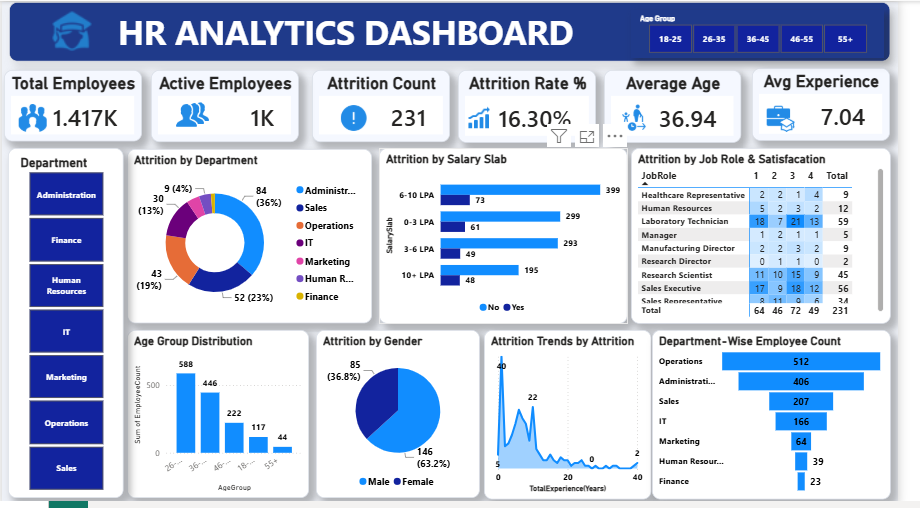

# 📊 HR Analytics Dashboard

## Overview
This Power BI dashboard provides insights into employee attrition, workforce demographics, job satisfaction, and performance metrics to support HR decision-making.

## Tools Used
- Power BI
- Power Query
- DAX
- Microsoft Excel

## Key KPIs
- Total Employees
- Attrition Count
- Attrition Rate
- Average Age
- Average Salary
- Average Years at Company

## Dashboard Features
- Employee Overview
- Attrition Analysis
- Department-wise Analysis
- Gender Distribution
- Education Field Analysis
- Age Group Analysis
- Job Role Analysis

## Skills Demonstrated
- Data Cleaning
- Data Modeling
- DAX Measures
- Interactive Visualizations
- Business Intelligence

## Dashboard Preview

## Files Included
- HR_Analytics_Dashboard.pbix
- Dashboard_Screenshot.png
- README.md

## Author
Muhammad Danial Khan
